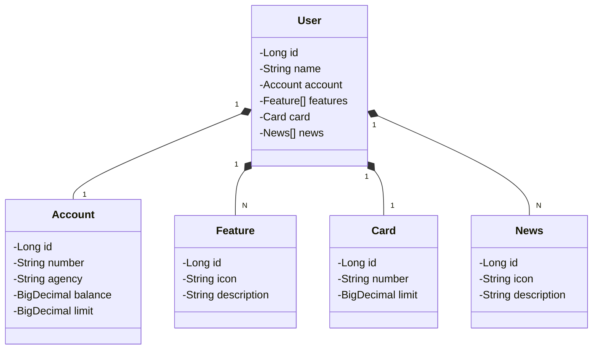

# DevBank - RESTful API

## Domain Diagram (Domain API)

```mermaid
classDiagram
  class User {
    -Long id
    -String name
    -Account account
    -Feature[] features
    -Card card
    -News[] news
  }

  class Account {
    -Long id
    -String number
    -String agency
    -BigDecimal balance
    -BigDecimal limit
  }

  class Feature {
    -Long id
    -String icon
    -String description
  }

  class Card {
    -Long id
    -String number
    -BigDecimal limit
  }

  class News {
    -Long id
    -String icon
    -String description
  }

  User "1" *-- "1" Account
  User "1" *-- "N" Feature
  User "1" *-- "1" Card
  User "1" *-- "N" News
```
